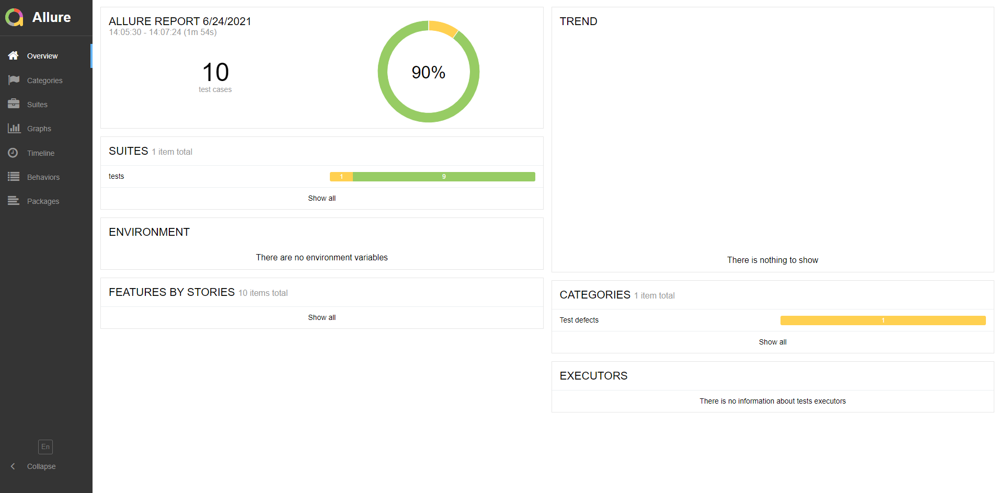
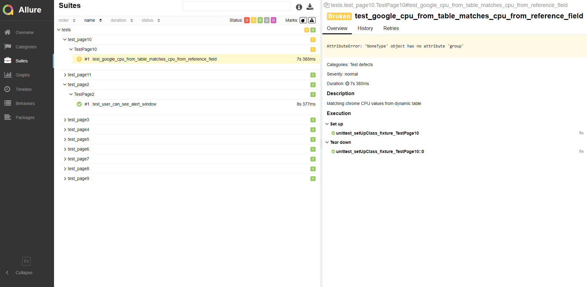
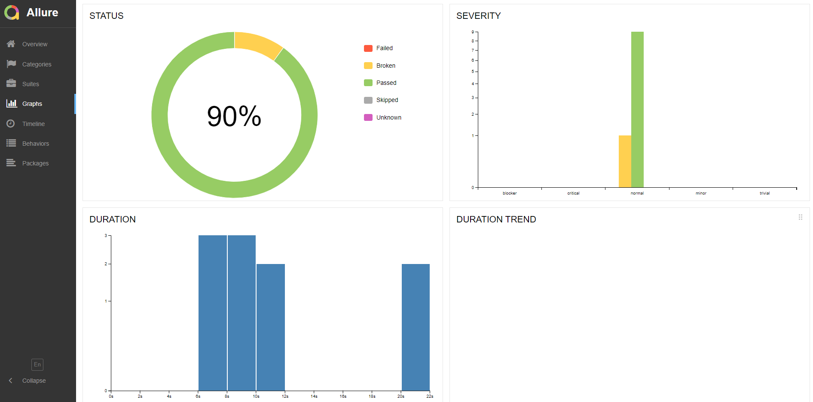

# Hometask Allure
## How to install
1. Clone the repository, switch to branch "run_with_allure"

```
https://github.com/vladimir-grigoriev/belitsoft_task3.git
```
2. Create and run virtualenv
```
python -m venv venv
. ./venv/bin/activate
```
3. Install all the requirements from requirements.txt
```
pip install -r requirements.txt
```
4. Make sure, that Chrome Webdriver folder exists in your PATH
5. Install Allure https://docs.qameta.io/, add it to your PATH variable
6. Run command to generate JSON reports in reports/ folder
```
pytest -v -s --alluredir="reports" tests/
```
7. Generate Allure report
```
allure serve path/to/reports
```
8. Press `<Ctrl+C>` to exit
___

## Some screenshots of Allure Reports


___

___

