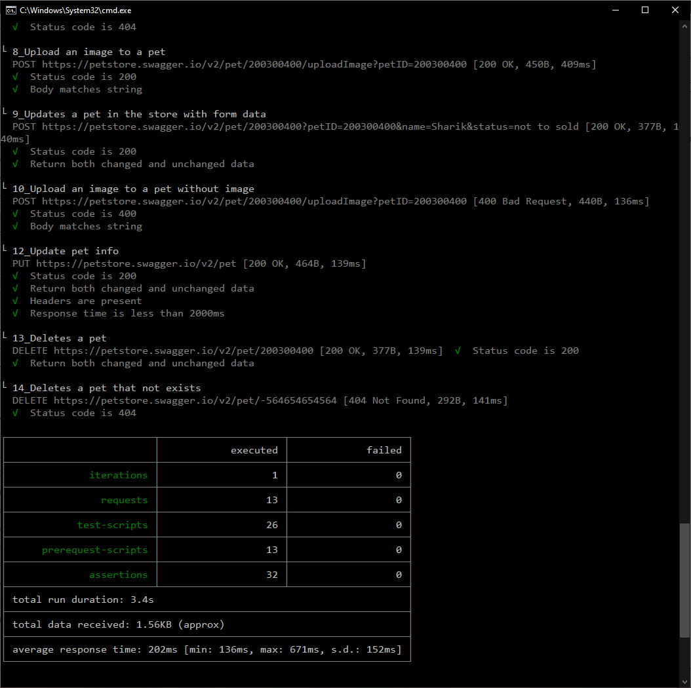

# Hometask 3

1. Tests for UI Playground are located in tests/ folder
2. Screenshots of the second task with postman and newman and the fourth task from the test challenge are attached below in the Readme.md, also they can be downloaded from img/ folder
___
Last updates (June 21, 2021):
1. Added pytest-xdist and nosetests-parallel to run tests in multiprocess
2. To run tests in multiprocess, run commands:
```
pytest -n auto
```
or
```
nosetests --processes=4
```
___
## How to install


1. Clone the repository

```
https://github.com/vladimir-grigoriev/belitsoft_task3.git
```
2. Create and run virtualenv
```
python -m venv venv
. ./venv/bin/activate
```
3. Install all the requirements from requirements.txt
```
pip install -r requirements.txt
```
4. Make sure, that Chrome Webdriver folder exists in your PATH
5. Run tests with the command
```
pytest tests/
```
___

### Screenshot for Postman + Newman task

___
### Screenshot for Testchallenge task

